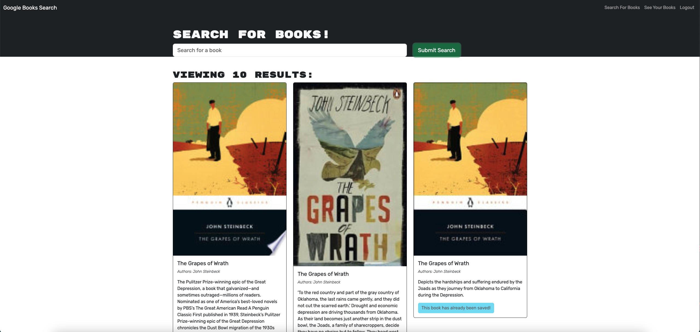

# Book Search Engine Starter Code

  
    
  ## Table of Contents

  * [Description](#description)
  * [Installation](#installation)
  * [Usage](#usage)
  * [License](https://choosealicense.com/licenses/MIT)
  * [Contributing](#contributing)
  * [Tests](#tests)
  * [Questions](#questions)
  
  ## [Description](#table-of-contents)

  This is a MERN stack (MongoDB, Express.js, React.js, Node.js) application that searches Google Books for a given book title, then displays the results. It has a user login function that then provides a method to save desired book titles from the search results to the logged in user's account. The internal database API functions are provided through a GraphQL API using Apollo Server. Security for app is provided by JSON Web Tokens and the jwt-decode module for the client side.  

  ## [Installation](#table-of-contents)

  N/A

  ## [Usage](#table-of-contents)

  

  [Deployed application on Heroku](https://tagne13-book-search-engine-36ba43af8475.herokuapp.com/)

  ## [License](#table-of-contents)

  The application is covered under the following license:
    
  [MIT](https://choosealicense.com/licenses/MIT)
    
  ## [Contributing](#table-of-contents)

  [Starter code](https://github.com/coding-boot-camp/cautious-meme) was provided by Xander Rapstine ([Xandromus](https://github.com/Xandromus))

  ## [Tests](#table-of-contents)

  N/A

  ## [Questions](#table-of-contents)

  Please contact me using the following links:

  [GitHub](https://github.com/Tagne13)

  [Email: Tagne13@gmail.com](mailto:Tagne13@gmail.com)